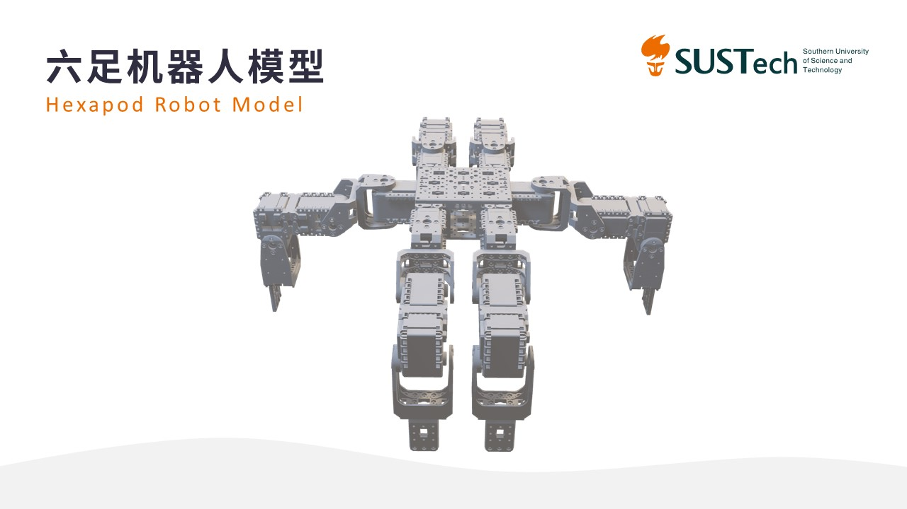
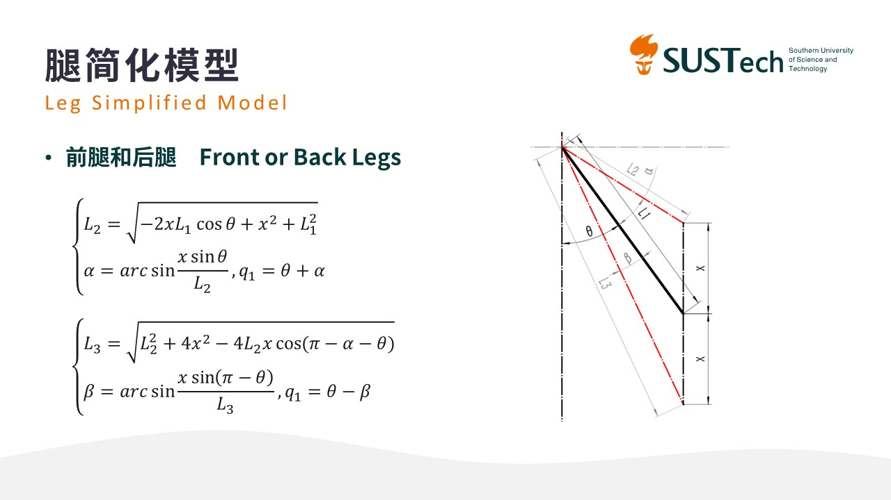
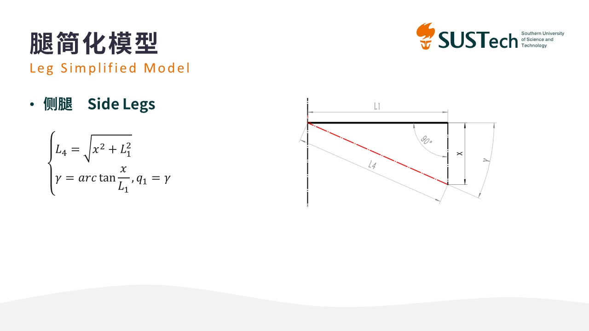
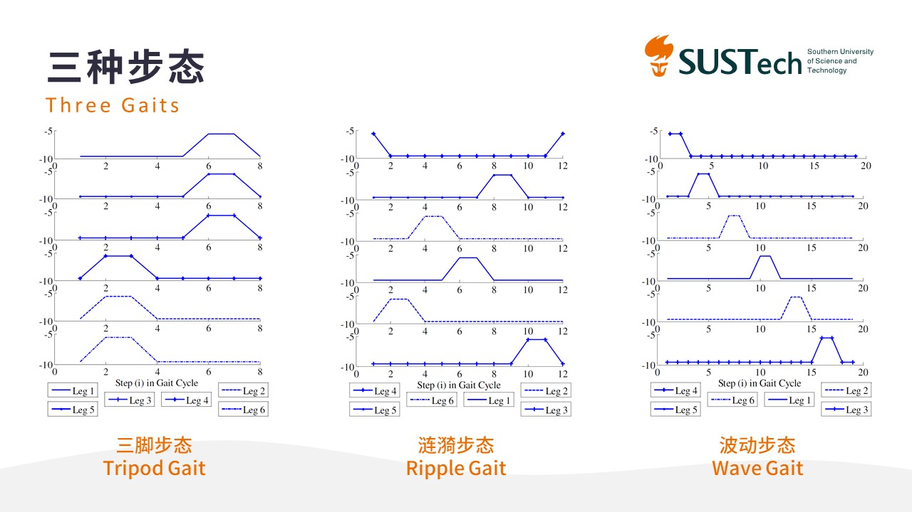
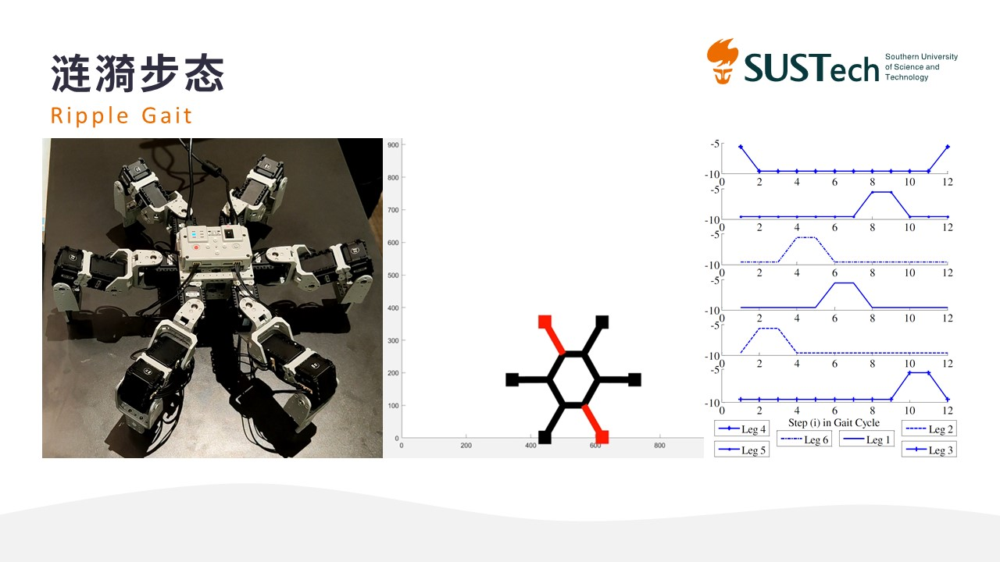
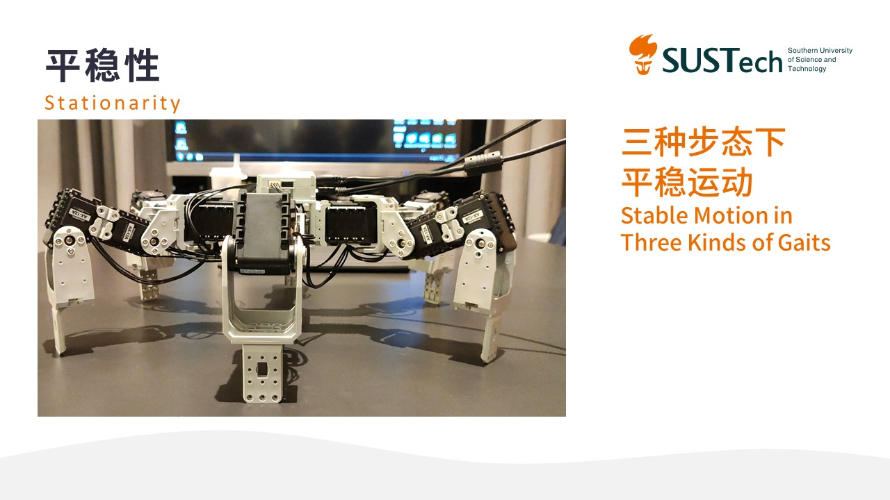
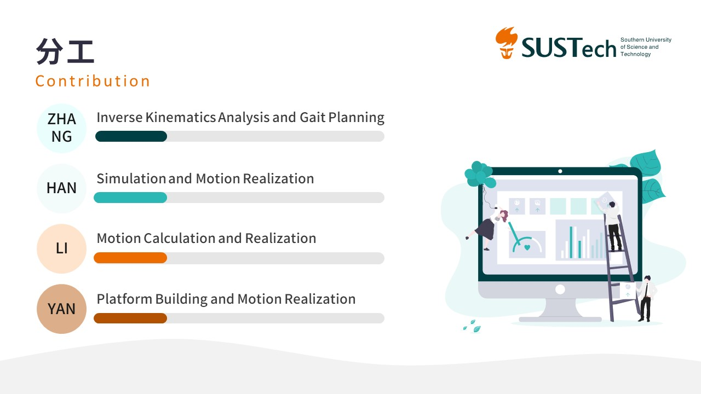

# Gait Analysis and Stable Walking of Hexapod Robot

Hexapod robot is one of the most stable robot configurations, but also has high flexibility. The motion form of hexapod robot includes three common gait and in situ rotation. This project hopes to plan the smooth motion through inverse kinematics calculation and simulation, and finally realize it on Robotis platform.

